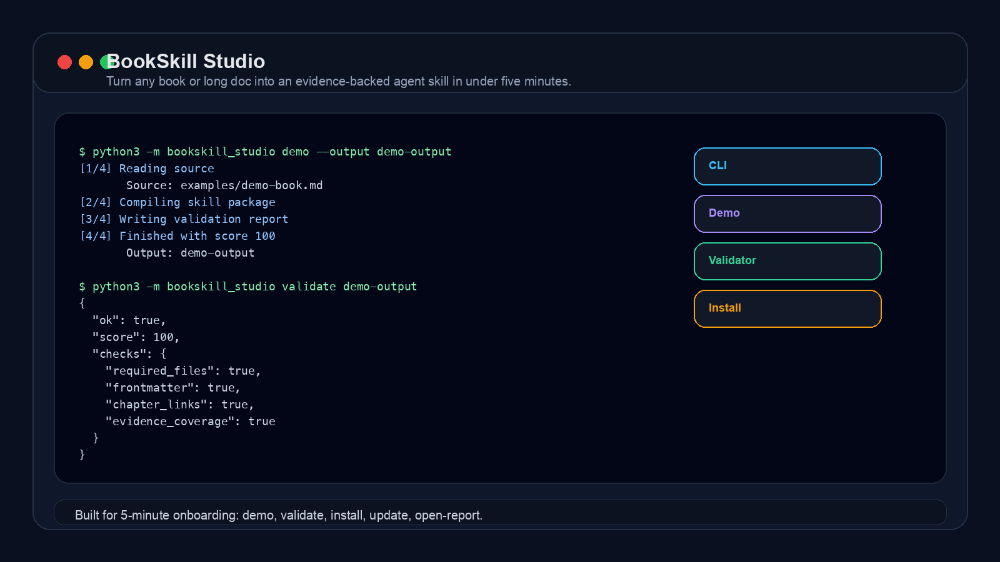
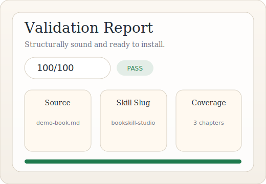

# BookSkill Studio

<p align="center">
  <a href="https://github.com/ayi-ai/bookskill-studio/actions/workflows/ci.yml"></a>
  <a href="https://github.com/ayi-ai/bookskill-studio/blob/main/LICENSE"></a>
  
  <a href="https://github.com/ayi-ai/bookskill-studio/releases"></a>
  
  
</p>

<p align="center">
  <a href="README.md#english"><strong>English</strong></a>
  &nbsp;·&nbsp;
  <a href="README.md#zh"><strong>中文（完整版）</strong></a>
</p>

<table>
  <tr>
    <td width="50%" valign="top">
      <strong>Turn any book or long doc into an evidence-backed agent skill in under five minutes.</strong><br><br>
      Deterministic CLI · demo · validator · install · <code>--lang en|zh|auto</code>
    </td>
    <td width="50%" valign="top">
      <strong>把任意书籍或长文档，在 5 分钟内编译成可追溯的 Agent Skill。</strong><br><br>
      确定性 CLI · 内置 demo · 校验报告 · 一键安装 · 支持 <code>--lang en|zh|auto</code>
    </td>
  </tr>
</table>

> 这是 GitHub 中文界面下的默认 README。英文用户请看 [README.md](README.md)。

BookSkill Studio 是一个轻量 CLI，能把源材料变成：

- 可安装的 `SKILL.md`
- 按章节拆分的配套文件
- 可追溯的证据映射
- 机器可读的校验报告
- 一键本地安装

## Demo 预览

<p align="center">
  
</p>

<table>
  <tr>
    <td width="58%" align="center" valign="top">
      <strong>终端运行</strong><br><br>
      
    </td>
    <td width="42%" align="center" valign="top">
      <strong>校验报告</strong><br><br>
      
    </td>
  </tr>
</table>

<p align="center"><sub>需要动图时：安装 <a href="https://github.com/charmbracelet/vhs">vhs</a> 后运行 <code>./scripts/generate-demo-gif.sh</code></sub></p>

## 使用前 / 使用后

**使用前：** 一本长书或文档文件夹，Agent 每次都要重新摸索。

**使用后：** 结构化 Skill 包，包含 `SKILL.md`、`chapters/`、证据映射与校验报告。

## 快速开始

运行内置 demo：

```bash
cd bookskill-studio
python3 -m pip install -e .
python3 -m bookskill_studio doctor
python3 -m bookskill_studio demo --output demo-output
python3 -m bookskill_studio validate demo-output
python3 -m bookskill_studio install demo-output --target cursor
python3 -m bookskill_studio open-report demo-output
```

编译中文书籍：

```bash
python3 -m bookskill_studio run my-book.md --output my-book-skill --lang zh
python3 -m bookskill_studio run my-book.md --output my-book-skill --lang auto
```

追加新素材：

```bash
python3 -m bookskill_studio update my-book-skill docs/new-notes.md
```

## 语言支持

| 参数 | 说明 |
|---|---|
| `--lang auto` | 默认。按正文中文/英文字符比例自动选择 |
| `--lang zh` | 生成中文 Skill 模板、速查表、校验报告 |
| `--lang en` | 生成英文输出 |

中文源材料额外支持：

- Markdown 二级标题、`第X章` 章节识别
- 中文概念提取
- 「当…应该/必须…」规则识别
- 中文校验报告 HTML

## 支持的输入格式

`.md`、`.txt`、`.epub`、`.pdf`

PDF 依赖 `pdftotext`，使用前请先运行 `doctor`。

## CLI

```bash
python3 -m bookskill_studio doctor
python3 -m bookskill_studio demo --output demo-output [--lang zh]
python3 -m bookskill_studio run <book.md> --output outdir [--lang auto]
python3 -m bookskill_studio validate <skill-dir>
python3 -m bookskill_studio install <skill-dir> --target cursor
python3 -m bookskill_studio open-report <skill-dir>
python3 -m bookskill_studio update <skill-dir> <new-source.md>
```

## 这个 MVP 做什么

- 支持 `.md`、`.txt`、`.epub`、`.pdf` 输入
- 从 Markdown 标题或 `Chapter` / `第X章` 识别章节
- 生成可安装 Skill 包与证据映射
- 输出 JSON / Markdown / HTML 校验报告
- 一键安装到 Codex、Claude、Cursor 或通用 Agent Skill 目录

## 开发

```bash
python3 -m pytest
```

<p align="center"><a href="README.md#english">Read in English</a></p>
